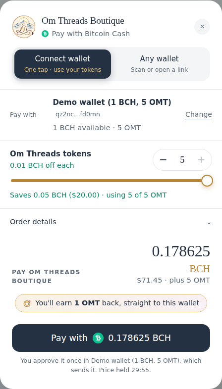
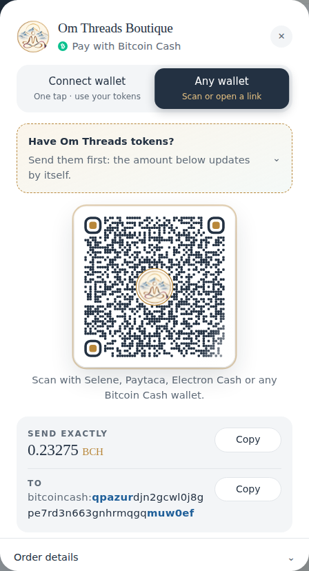
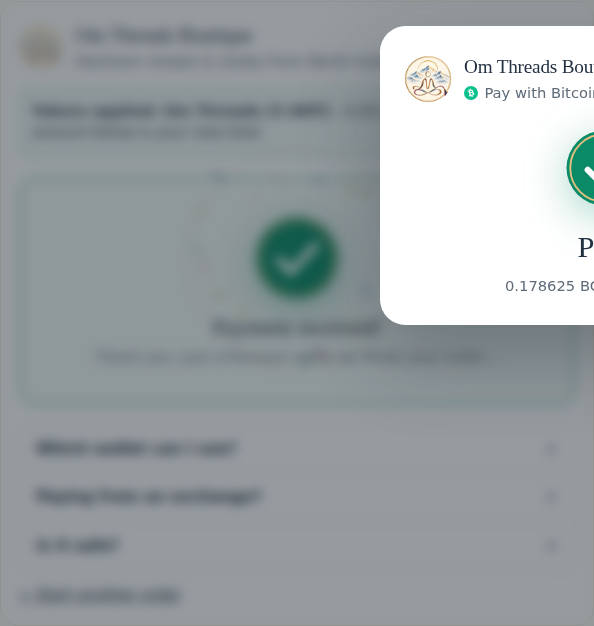
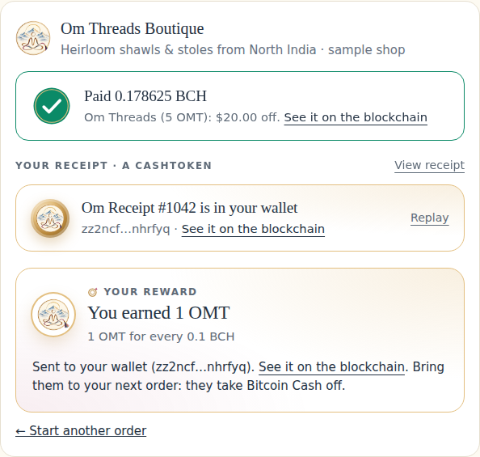
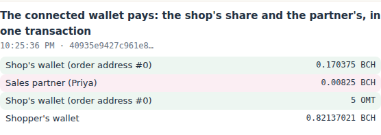

# bch_cashtoken_checkout

Accept **Bitcoin Cash** on your own website, paid straight into your own wallet. Give loyal customers **CashTokens** they hold in their own wallets: coupons at checkout, and rewards after they pay, in a token you mint yourself.

Fork it, copy what you need into your shop, and make the payment screen look like your site.

**[▶ Try the live demo](https://btheis15.github.io/bch_cashtoken_checkout/)**: the kit's real code and payment
screen running in your browser against a simulated Bitcoin Cash network, with
[Om Threads Boutique](https://omthreadsboutique.vercel.app) (a real shop running this code) as the sample shop.
No wallet or server needed. ([What's in it](#see-it-work))

<p align="center">
  
  &nbsp;
  
</p>

- **No payment company, account or fees.** You give your server your wallet's
  **xPub**. That extended *public* key lists the wallet's addresses but can't spend.
- **Each order gets its own address** in your wallet. Your server watches the
  blockchain itself through the community's public Fulcrum servers.
- **Zero-conf, as the BCH community expects.** A payment counts seconds after
  it reaches the network. Before that, the server listens briefly for a
  **double-spend proof**. See [docs/zero-conf.md](docs/zero-conf.md).
- **CashTokens coupons.** Percent or dollar coupons, one per order. Or
  **BCH-valued tokens** (each worth, say, 0.01 BCH off) that add up, a few at
  a time. Sales tax is worked out on the lower price. See [docs/coupons.md](docs/coupons.md).
- **Connect wallet.** Cashonize, Paytaca and Zapit connect over
  WalletConnect. The shopper picks how many tokens to use on a slider, then
  approves **one transaction** that pays the BCH and spends the tokens
  together. See [docs/wallet-connect.md](docs/wallet-connect.md).
- **Rewards.** Cash back in your own token after a BCH payment, such as 1
  token for every 0.1 BCH. It's sent straight back to a connected wallet, or
  claimed on the order page. See [docs/rewards.md](docs/rewards.md).
- **Receipts as CashTokens.** The shopper picks email, CashToken or both. The
  CashToken is a one-of-a-kind NFT in their wallet ("Receipt #1042"), and what
  wallets show is published with each one, with nothing personal on chain. On
  screen, the paper receipt folds into a coin that's thrown into their
  wallet. See [docs/receipts.md](docs/receipts.md).
- **Commissions for sales partners.** Let other people sell for you: a sale
  through a partner's link pays them their share of the items (never shipping
  or tax) at the moment you're paid, in the shopper's own transaction from a
  connected wallet, or from the hot wallet. Payout addresses are checked
  against the US sanctions list. See [docs/commissions.md](docs/commissions.md).
- **Mint your own token from your server.** The whole supply goes into a
  small hot wallet, along with what wallets show for the token: name, symbol,
  icon and description, published on chain as a BCMR registry. You can update
  it later. See [docs/token.md](docs/token.md).
- **A payment screen people enjoy using.** It's React with plain CSS, themed
  with CSS variables. See [docs/payment-screen.md](docs/payment-screen.md).
  - A pay sheet that slides up, with "Connect wallet" and "Any wallet" (QR code or "Open in my wallet app")
  - A QR code that ripples in around your logo, and digits that roll into place
  - A price-hold bar that runs down, and copy buttons that tick
  - The order in BCH, line by line, which updates as the token slider moves
  - A "Payment received!" burst when the payment lands, then the reward card
  - The receipt folding into a coin, spinning, and thrown into the shopper's wallet

```
 your checkout ──▶ start(order): address xpub/0/<n> reserved, BCH price from the exchanges
 payment screen ─▶ Connect wallet ─▶ walletBuild: one transaction (BCH + tokens) ─▶ the wallet signs and sends it
                └▶ Any wallet: QR / "open in wallet"  (bitcoincash:q…?amount=…&message=…)
 the network ──Fulcrum notice──▶ check(order):
                       · enough arrived → listen ~3 s for a double-spend proof → paid (onPaid) → reward
                       · a double-spend proof → held until a block settles it
                       · less than asked → the screen asks for the rest
                       · coupon tokens (to the z… form of the same address) → discount, new price
 rewards ─▶ from your hot wallet: back to the wallet that paid, or claimed on the order page
 your token ─▶ minted from the hot wallet; wallets read /bcmr/<category>.json (its hash is on chain)
```

## See it work

**[The live demo](https://btheis15.github.io/bch_cashtoken_checkout/)** runs `src/` and `examples/react/` unchanged in
the browser. The network is the same stand-in the tests use (`test/fakes.mjs`): real transactions, built and signed
with libauth, just never broadcast. A panel beside the checkout lets you be the network, and shows every
transaction's outputs, what the shop sees, and the engine's own log.

| Try | What you'll see |
|---|---|
| **Connect wallet** in the pay sheet | A simulated wallet (1 BCH, 5 OMT) connects, the token slider takes $20 off, and one transaction pays the shop, the sales partner's 5% and spends the coupons. The reward (1 OMT) comes straight back, and the receipt arrives as an NFT. |
| **Any wallet pays the QR code** | The payment counts after the double-spend-proof wait, the partner's share goes from the hot wallet at once, and the reward and receipt wait to be claimed (the payer might be an exchange). |
| **Send 3 OMT coupon tokens first** | The price drops by 0.03 BCH, held at the same rate and time, with the sales tax worked out again on the lower price. |
| **Pay, with a double-spend attempt** | "Payment received", then held: the network has a proof. **Mine a block** settles it. |
| **A multisig wallet pays** | Accepted but flagged (proofs can't cover script wallets), and the partner's share waits for a block. |
| **Pay only half** | The screen asks for the rest. |

<table>
  <tr>
    <td></td>
    <td></td>
  </tr>
  <tr>
    <td colspan="2"><br>
    <sub>One transaction from a connected wallet: the shop's share, the sales partner's 5% of the items, and the coupon tokens.</sub></td>
  </tr>
</table>

Run it yourself:

```sh
npm install && npm run demo     # http://localhost:5173
```

## Feedback wanted

This is built for the BCH community's own tools (Fulcrum, DSProofs, CashTokens, BCMR, wc2-bch-bcr), and it's
running for a real shop. Before more shops pick it up, we'd love your eyes on:

1. **Zero-conf policy.** A payment counts after listening 3 seconds for a double-spend proof; with a proof it's held
   for a block; script and multisig payments (which proofs can't cover) are accepted but flagged "wait for a block
   before shipping". Is that the right default? See [docs/zero-conf.md](docs/zero-conf.md).
2. **Addresses from an xPub.** Each order gets the next unused address; an abandoned checkout's address is handed out
   again after a week, so unused addresses stay within a wallet's gap limit of 20. Does that hold for the wallets you
   use?
3. **Prices.** The middle of Coinbase, Kraken, Bitstamp and CoinGecko, only when two agree within 1.5%, held 30
   minutes. Better sources?
4. **CashTokens as coupons.** Tokens sent to the order's token address before paying (or spent in the same
   transaction from a connected wallet) take BCH off. Which wallets struggle to send tokens alongside a payment?
5. **Connect wallet.** Tested with Cashonize, Paytaca and Zapit over wc2-bch-bcr. Others?
6. **Receipts as NFTs.** One-of-a-kind NFTs with a BCMR registry per receipt (nothing personal on chain). Useful, or
   noise in people's wallets?
7. **Sales partners.** The partner's share as a second output of the shopper's own transaction, counted toward the
   order only up to their share. Any wallet that won't sign a payment with two outputs?
8. **Fulcrum servers.** The defaults are in `src/bch.js` (`FULCRUM_SERVERS`), preferring those with double-spend
   proofs. Which should be on the list?

Open an issue, or reply wherever you found the link.

## What's here

| Path | What it is |
|---|---|
| [`src/checkout.js`](src/checkout.js) | The payment engine: `start`, `view`, `check`, `renew`, `close`, `tick`. It has the zero-conf and coupon rules, Connect wallet (`walletInfo`, `walletQuote`, `walletBuild`, `walletSubmit`) and rewards (`claimReward`, `rewardsStatus`, `testReward`). |
| [`src/bch.js`](src/bch.js) | The Bitcoin Cash layer. Wallet addresses from an xPub, and exchange prices (two must agree). The Fulcrum connection, which prefers servers with double-spend proofs. Reading payments and tokens from raw transactions. Building, signing and checking transactions (WalletConnect payments, rewards, minting) with the BCH virtual machine. BCMR publications. |
| [`src/tokens.js`](src/tokens.js) | Token amounts, plus `checkCoupons` and `checkRewards` to validate your settings. |
| [`src/hot-wallet.js`](src/hot-wallet.js) | The small wallet whose key is on your server. It sends rewards and mints your token, one send at a time, and never spends the token's identity output. |
| [`src/rewards.js`](src/rewards.js) | The rewards engine, used by `createBchCheckout({ rewards })`. |
| [`src/receipts.js`](src/receipts.js) | Receipts as CashTokens: the collection (a minting baton in the hot wallet), and each receipt minted with the registry that lists it. |
| [`src/commissions.js`](src/commissions.js) | Commissions for sales partners, used by `createBchCheckout({ commissions })`: the split in a connected wallet's payment, or a payout from the hot wallet. |
| [`src/sanctions.js`](src/sanctions.js) | Screening addresses you pay against the US sanctions list (OFAC's SDN list, downloaded daily). |
| [`src/token.js`](src/token.js) | Minting your token and updating what wallets show for it (CashTokens genesis, CHIP-BCMR authchain). |
| [`src/memory-store.js`](src/memory-store.js), [`src/file-store.js`](src/file-store.js) | The storage interface, in memory or in a JSON file. Use your database in production; [docs/integration.md](docs/integration.md) has a SQL schema. |
| [`examples/server.mjs`](examples/server.mjs) | A JSON API around all of it (Node's `http`, no framework): checkout, Connect wallet, rewards, the BCMR registry, and admin routes for minting. |
| [`examples/react/`](examples/react) | The payment screen: `BchPay`, `PaySheet`, `BchRewardCard`, and `ReceiptToken` and `ReceiptChoice`, plus the WalletConnect connector, the API client and `bch-pay.css`. |
| [`test/`](test) | Tests against a stand-in network that builds real BCH transactions (libauth). Wallet payments, rewards and minting are signed and run through the BCH virtual machine. |
| [`demo/`](demo) | The live demo: the kit and its payment screen in the browser, against a simulated network, with Om Threads Boutique as the sample shop. |
| [`docs/`](docs) | [Integration](docs/integration.md) · [Zero-conf](docs/zero-conf.md) · [Coupons](docs/coupons.md) · [Connect wallet](docs/wallet-connect.md) · [Rewards](docs/rewards.md) · [Receipts](docs/receipts.md) · [Commissions](docs/commissions.md) · [Your token](docs/token.md) · [Payment screen](docs/payment-screen.md) · [Wallets](docs/wallets.md) |

## Try it

You need Node 22+ and a Bitcoin Cash wallet that shows its xPub. Use a wallet
just for the shop:

- **Selene:** Settings → Wallet → xPub (to make one just for the shop, add a new wallet)
- **Electron Cash:** Wallet → Information → Master Public Key

```sh
npm install
npm test
XPUB=xpub6… npm run example
curl -X POST localhost:8080/api/orders -d '{"id":"1001","subtotalCents":25}'
curl localhost:8080/api/orders/1001
```

The server prints your wallet's first receiving address; check it matches your
wallet. Send the amount shown from any BCH wallet. Within a few seconds the
order shows `"state": "paid"`, and the money is in your wallet.

Then add the rest:

1. `npm run new-wallet` makes the hot wallet's key. Restart with
   `HOT_WALLET_WIF=… SITE_URL=https://your.shop ADMIN_TOKEN=…`, and send the
   hot wallet about 0.0002 BCH.
2. Mint your token:
   ```sh
   curl -X POST localhost:8080/admin/token -H "Authorization: Bearer $ADMIN_TOKEN" \
     -d '{"name":"Shop Rewards","symbol":"SHOP","supply":1000000,"icon":"https://your.shop/token.png"}'
   ```
3. Use its category ID in `COUPONS` and `REWARDS` (see the top of
   [`examples/server.mjs`](examples/server.mjs)), and serve `/bcmr/*` from
   your website.

## In your shop

```js
import { createBchCheckout } from "bch-cashtoken-checkout";
import { createBchChain } from "bch-cashtoken-checkout/bch";
import { createHotWallet } from "bch-cashtoken-checkout/hot-wallet";

const chain = createBchChain();                       // shared by everything below
const wallet = createHotWallet({ wif: process.env.BCH_HOT_WALLET_WIF, chain });

const bch = createBchCheckout({
  xpub: process.env.BCH_XPUB,                         // keep it private: it reveals your wallet's history
  store: myDatabaseStore,                             // see src/memory-store.js for the interface
  chain,
  coupons: () => settings.bchCoupons,                 // e.g. [{ category, label: "Shop token", token: "ft", kind: "bch", value: 0.01, symbol: "SHOP" }]
  rewards: { wallet, settings: () => settings.bchRewards }, // e.g. { enabled: true, category, symbol: "SHOP", perBch: 0.1, tokens: 1 }
  onCoupon: async (payment, coupon, discountCents) => recalcTax(payment, discountCents), // → { totalCents, taxCents }
  onPaid: (p) => fulfil(p.id),                        // lower stock, email the receipt…
  onNotice: (p, n) => n.problem && alertOwner(p.id, n.message),
});

// At checkout, with the amounts from your own database (never from the browser):
const view = await bch.start({ id: order.id, label: `Order ${order.number}`, subtotalCents, shippingCents, taxCents, itemCount });
// The payment screen polls your API, which returns bch.check(id) (throttled) or bch.view(id).
setInterval(() => bch.tick(), 60_000);
await bch.watchAll();                                 // after a restart
```

Read [docs/integration.md](docs/integration.md) before going live. It covers
the store interface, the background job, test orders (BCH has no test
network), refunds, and a security checklist.

## Decisions, and why

- **xPub, not a payment processor.** Money goes straight to the merchant, and
  nothing on the server can spend it. A private key (xprv) is refused outright.
  The only key on the server belongs to the **hot wallet**. It holds the
  token supply and a little BCH for fees, never the shop's takings.
- **Zero-conf with double-spend proofs:**
  - BCH nodes keep the first-seen transaction, don't do replace-by-fee, and relay DSProofs.
  - The DSProof spec tells merchants to wait a few seconds for a proof, which
    arrive in under 3 seconds, before accepting.
  - Payments proofs can't cover (from script or multisig wallets) still go
    through, flagged "wait for a block before shipping".
  - [docs/zero-conf.md](docs/zero-conf.md) has the sources.
- **Two agreeing exchanges.** Prices come from Coinbase, Kraken, Bitstamp and
  CoinGecko. The middle one is used, and only when at least two agree within
  1.5%; otherwise the checkout says BCH is unavailable rather than guess. A
  price is held 30 minutes. Tokens sent during a price keep that price's rate
  and end time.
- **Addresses are reused carefully.**
  - An abandoned checkout's address is handed out again after a week, if nothing ever arrived.
  - That keeps unused addresses within the 20 a wallet looks ahead (BIP44's gap limit; Selene uses 20).
  - An address that has ever received anything is never handed out again.
- **Coupons move.** A coupon token is sent to the merchant (to the order's
  address), so it can't be used twice. No signing step or registry of used
  serials is needed. It works from any wallet that holds CashTokens, and from
  a connected wallet in the same transaction as the payment.
- **The server builds the wallet transaction, the wallet signs it.** It pays
  exactly what was quoted, spends only plain coins and that one token
  (never an NFT or another token), and the wallet sends it itself. The signed
  copy is checked against the quote before the server sends it too.
- **Every transaction from the hot wallet is checked and recorded first.**
  Rewards and minting run through the BCH virtual machine before they're
  recorded, and only then broadcast. A retry sends the very same transaction,
  so a lost reply never pays twice or mints twice.
- **Rewards only go where tokens are safe.** A connected wallet is proved by
  the payment's own inputs. Anything else (perhaps an exchange) has to claim.

## License

MIT. Dependencies: [libauth](https://github.com/bitauth/libauth) (MIT) and
[@electrum-cash/network](https://gitlab.com/electrum-cash/network) (MIT). The
payment screen uses [uqr](https://github.com/unjs/uqr) (MIT) and, for Connect
wallet, [@walletconnect/sign-client](https://github.com/WalletConnect/walletconnect-monorepo) (Apache-2.0).
